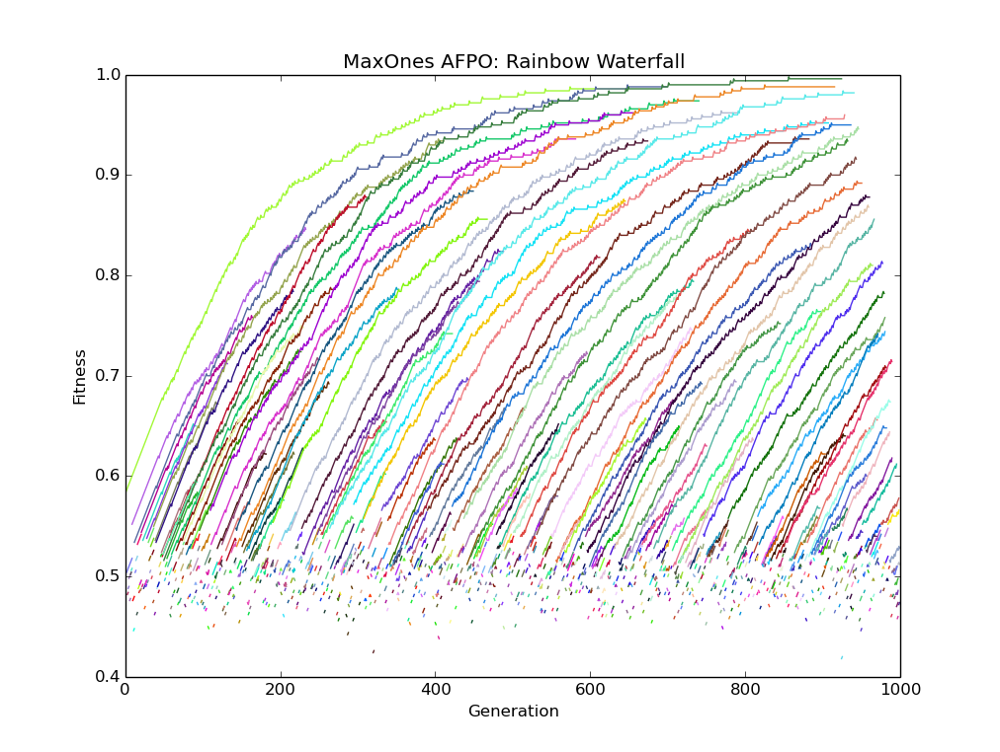

# Sloan Preliminary Project v1: 
## MaxOnes String Matching with AFPO

All code is in basic python 3.6 (no NumPy). MaxOnes is a problem in which a
population of individuals is evaluated based on their proximity to a target
bit string consisting solely of ones. Fitness is defined to be the ratio of 
correct to incorrect guesses (e.g. target=[1,1], i=[0,1], fitness = 0.5).
Mutation, then, corresponds to randomized bit-flipping.

[AFPO](https://link.springer.com/chapter/10.1007/978-1-4419-7747-2_8) is a multi-objective evolutionary algorithm which seeks to preserve the
innovations of younger cohorts by protecting them from domination by their 
older counterparts. An individual is only dominated (that is, removed from
the population) if another individual has BOTH higher fitness and a lower age.
Descendants inherit the age of their parent.

In the event of a tie (same fitness; same age) the individual who was spawned 
most recently is preserved. The reason for this is to expose a greater number
of possible phenotypic pathways to selection (Wagner, 2011).

Parameters like population size and length of genetic strings are modifiable 
in the "Run" file.

Below is an example fitness plot for AFPO where the length of the target bitstring=500.
The population size was set to 100, and the algorithm was terminated after 1000 generations.
Normally, we'd expect to see more usurpations by younger cohorts, but given the nature of
the problem, innovations are necessarily minor. A single bit-flip won't result in a 
significant change in fitness. For smaller target strings, there's greater turnover.
However, the convergence also happens much faster, so this behavior isn't as apparent
as in [Cheney et.al 2018](http://www.ncheney.com/pubs/pdf/2018_CheneyBongardSunSpiralLipson_ScalableCoOptimizationOfMorphologyAndControlInEmbodiedMachines_RoyalSocietyInterface.pdf).

